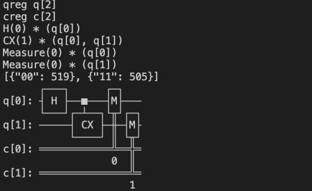

Demo示例	
==========
+ 在对应python版本下运行，
.. code-block:: 

    # import package
    from qutrunk.circuit import QCircuit
    from qutrunk.circuit.gates import H, CNOT, Measure, All
    # allocate resource
    qc = QCircuit()
    qr = qc.allocate(2)
    # apply quantum gates
    H * qr[0]
    CNOT * (qr[0], qr[1])
    All(Measure) * qr
    # print circuit
    qc.print()
    # run circuit
    res = qc.run(shots=1024)
    # print result
    print(res.get_counts())
    # draw circuit
    qc.draw()

.. admonition:: 注解

 该示例采用量子汇编语言，例如 ``H * qr[0]`` ``CNOT * (qr[0], qr[1])`` ``All(Measure) * qr``，具体请参考QuSL量子汇编。
   
   
+ 结果如下图所示：

   