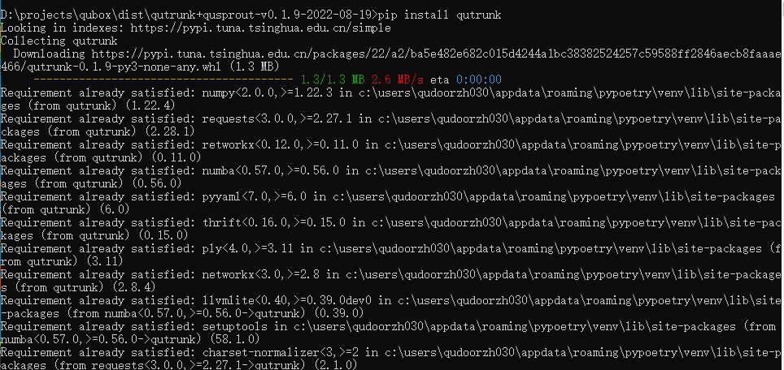
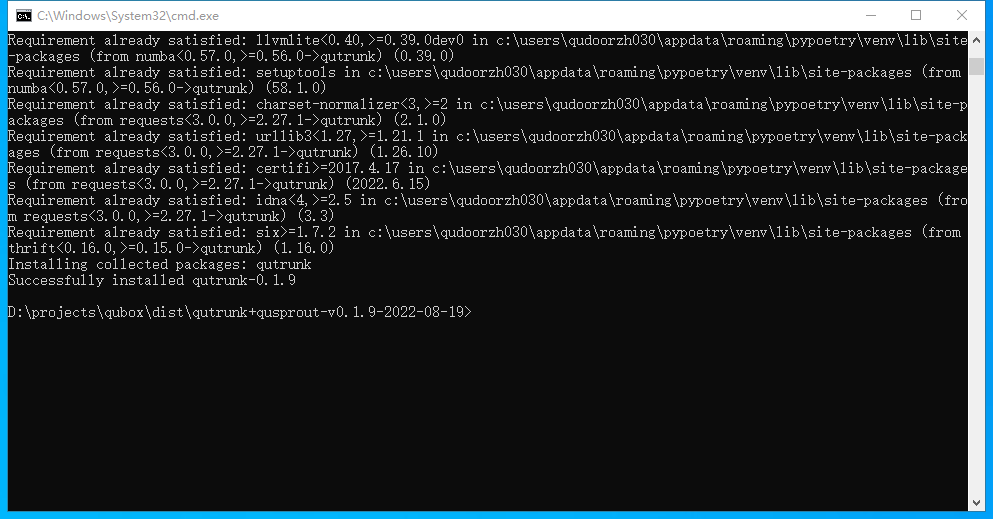

安装
=============================

您可以通过以下途径下载安装QuTrunk:

pip 安装
-------------

+ 在使用qutrunk之前，您需要先安装Python(版本3.7+)。qutrunk发布于PyPI官网，可以通过pip命令进行安装：
.. code-block:: 

    pip install qutrunk

   

+ 完成安装后显示如下：

源码安装
------------------

MacOS
>>>>>>>>>>>>>>>>
在安装之前，确认下载qutrunk（qutrunk发布于PyPI官网，可在官网下载源码包）.

+ 首先，确认安装C/C++编译器和编译工具，打开终端执行gcc --version可以查询是否安装，一般MacOS上都默认已经安装。
+ 另外还需要安装cmake，在终端直接执行：
.. code-block:: 

    pip3 install cmake

+ 编译依赖安装完后，再切换到下载目录，解压并开始编译安装qutrunk：
.. code-block:: 

    tar -zxvf qutrunk-0.1.9.tar.gz
	cd qutrunk-0.1.9 
	python3 setup.py install

Ubuntu
>>>>>>>>>>>>>>>>
+ 首先,安装c/c++编译器: 
.. code-block:: 

    sudo apt install build-essential
+ 然后,安装cmake编译工具: 
.. code-block:: 

    sudo apt install cmake
+ 最后,在编译安装qutrunk：
.. code-block:: 

    tar -zxvf qutrunk-0.1.9.tar.gz
    cd qutrunk-0.1.9
    python3 setup.py install

Windows
>>>>>>>>>>>>>>>>
+ 先安装C++编译器：
下载安装visual studio，选择社区版本，安装界面勾选 ``使用C++的桌面开发`` 完成visual studio安装。

+ 然后安装再cmake，命令行执行
.. code-block:: 

    pip install cmake
+ 最后编译安装，解压下载的源码安装包，进入到解压目录下，执行:
.. code-block:: 

    python setup.py install
	

