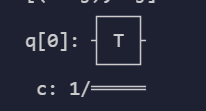
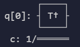

# QuTrunk使用指导-量子门操作（qutrunk-0.1.13版本）

本章开始介绍QuTrunk的量子比特量子门操作，量子门的操作包括如下几类：

- 单量子比特量子门操作
- 多量子比特量子门操作
- 自定义量子门

以下示例中执行门操作的程序运行，需要提取导入所需qutrunk的包

```python
from qutrunk.circuit import QCircuit
from qutrunk.circuit.gates import *
from numpy import pi
```

## 1、 单量子比特门操作

QuTrunk当前支持的单量子比特门包括：$H，X，Y，Z，P，S，\text{Sdg}，T，\text{Tdg，U1，U2，U3}，Rx，Ry，Rz，I，\text{X1,，Y1，Z1，SqrtX}$ 门

### 1.1 单量子比特状态

单量子比特的状态可以表示为：
$$
\ket{\psi}=\alpha\ket{0}+\beta \ket{1}
$$
其中α和β都是复数，且满足: $|\alpha|^2+ |\beta|^2 = 1$

### 1.2 H门

Hadamard门，数学表达式为：
$$
\begin{split}H=\frac {1}{\sqrt{2}}\begin{pmatrix}
1 & 1\\
1 & -1
\end{pmatrix}\end{split}
$$
对初始化状态的为$\left| 0\right \rangle$量子比特执行H门操作，代码如下：

```python
qc= QCircuit()
qr = qc.allocate(1)
H * qr[0]   
qc.draw()
```

打印的电路图如下：


执行$H$门操作的数学计算结果如下：
$$
\begin{split}H \ket{0}=\frac {1}{\sqrt{2}}\begin{pmatrix}
1 & 1\\
1 & -1
\end{pmatrix}\ket{0}=\frac {1}{\sqrt{2}}\begin{pmatrix}
1 & 1\\
1 & -1
\end{pmatrix}\begin{pmatrix}
1 \\
0 
\end{pmatrix}=\frac {1}{\sqrt{2}}\begin{pmatrix}
1 \\
1 
\end{pmatrix}=\frac {\ket{0}+\ket{1}}{\sqrt{2}}\end{split}
$$
H门作用就是将初始化$\left| 0\right \rangle$状态的量子比特置于叠加态。我们也可以针对实施门操作的后的线路获取其向量，获取方法如下：

```python
result=qc.get_statevector()
print(result)
```

通过print打印出来的结果是：

```text
[(0.7071067811865475+0j), (0.7071067811865475+0j)]
```

### 1.3 X门

经典计算中NOT门作用是将比特翻转，量子计算中的与之作用相对应的是X门，$X$门又称翻转门或NOT门，其数学定义为
$$
X=\begin{pmatrix}
0 & 1\\
1 & 0
\end{pmatrix}
$$
我们可以从下面的数学运算中看出，对任意一个量子比特执行X门操作后，运算结果如下：
$$
X|\varphi>=\left[
\matrix{
  0 & 1\\
  1 & 0\\
}
\right](\alpha\left| 0\right \rangle+\beta \left| 1\right \rangle)=\left[
\matrix{
  0 & 1\\
  1 & 0\\
}
\right]\left[
\matrix{
  \alpha\\
  \beta\\
}
\right]=\left[
\matrix{
  \beta\\
  \alpha\\
}
\right]=\beta\left| 0\right \rangle+\alpha \left|1\right \rangle
$$
即实现了翻转，对一个量子比特执行X门操作代码如下：

```python
qc= QCircuit()
qr = qc.allocate(1)
X * qr[0] 
qc.draw()
```

打印结果如下：


我们可以在X操作前和执行后分别打印电路向量值，作为参考：

```python
qc = QCircuit()
qr = qc.allocate(1)

r1=qc.get_statevector()
print(r1)
print(X)
X * qr[0]

r2=qc.get_statevector()
print(r2)
```

输出的结果对比如下：

```python
[(1+0j), 0j]#初始化向量
[0j, (1+0j)]#门操作后的向量
```

从结果可以看到，初始化的$\left| 0\right \rangle$实现了量子比特的翻转为$\left| 1\right \rangle$。

### 1.4 Y门

$Y$门是将量子比特绕布洛赫球的y轴旋转π角度，其作用是进行相位转移和比特翻转，定义如下：

​                                              $Y\left |0\right \rangle =i\left |1\right \rangle $

​                                              $Y\left |1\right \rangle =-i\left |0\right \rangle$

其矩阵和狄拉克符号表达式为：
$$
Y=\begin{pmatrix}
0 & -i\\
i & 0
\end{pmatrix}=i\left |1\right \rangle \left \langle 0 \right | -i\left | 0  \right \rangle \left \langle 1 \right |
$$
QuTrunk中对一个量子比特执行Y门的操作程序如下：

```Python
qc= QCircuit()
qr = qc.allocate(1)
Y * qr[0] 
qc.draw()
```


获取其向量值

```python
result=qc.get_statevector()
print(result)
#也可以直接简写print(qc.get_statevector())
```

输出结果为：

```python
[0j, 1j]
```

### 1.5 Z门

$Z$门的作用是转变相位，其数学定义如下：

​                                              $Z\left |0\right \rangle =\left |0\right \rangle $

​                                              $Z\left |1\right \rangle =-\left |1\right \rangle$

用矩阵和狄拉克符号表示如下：
$$
Z=\begin{pmatrix}
1 & 0\\
0 & -1
\end{pmatrix}=\left |0\right \rangle \left \langle 0 \right | -\left | 1 \right \rangle \left \langle 1 \right |
$$
QuTrunk中对量子比特执行Z门操作的程序如下：

```python
qc= QCircuit()
qr = qc.allocate(1)
Z * qr[0] 
qc.draw()
```


获取其向量值如下，Z门只改变相位，所以执行后无变化

```
[(1+0j), 0j]
```

### 1.6 P门

$P$门将量子比特$\left| 0\right \rangle$态和$\left| 1\right \rangle$态的相位根据给定的角度进行移动，它的数学表示式与U1门一样，其数学定义如下：
$$
P(\lambda)=\begin{pmatrix}
1  & 0\\
0  & e^{i\lambda} 
\end{pmatrix}
$$
对一个初始化态的量子比特执行P门操作：

```python
qc= QCircuit()
qr = qc.allocate(1)
P(pi/2) * qr[0] 
qc.draw()
```

其电路图为：


### 1.7 S门

$S$门操作是量子比特绕布洛赫球的z轴旋转π/2的角度，其数学定义为：
$$
\begin{split}S =
\begin{pmatrix}
1 & 0\\
0 & i
\end{pmatrix}\end{split}
$$
执行S门操作如下：

```python
qc= QCircuit()
qr = qc.allocate(1)
S * qr[0] 
qc.draw()
```

其线路图为：


### 1.8 Sdg门

Sdg门是对$S$门的反向操作, 绕布洛赫球的z轴反方向旋转π/2的角度，其数学定义为：
$$
\begin{split}S =
\begin{pmatrix}
1 & 0\\
0 & -i
\end{pmatrix}\end{split}
$$
执行S门操作如下：

```python
qc= QCircuit()
qr = qc.allocate(1)
Sdg * qr[0] 
qc.draw()
```

其线路图为：


### 1.9 T门

$T$门是量子比特绕布洛赫球的z轴旋转π/4角度，数学定义如下：
$$
\begin{split}T =
\begin{pmatrix}
1 & 0\\
0 & e^{i \pi/4}
\end{pmatrix}\end{split}
$$

```Python
qc= QCircuit()
qr = qc.allocate(1)
T * qr[0] 
qc.draw()
```



### 1.10 Tdg门

Tdg门是对T门的反向操作（也可以记作$T^\dagger$), 是将量子比特绕布洛赫球的z轴反方向旋转π/4角度，其数学定义如下：
$$
\begin{split}T^{\dagger} =
\begin{pmatrix}
1 & 0\\
0 & e^{-i \pi/4}
\end{pmatrix}\end{split}
$$
对一个初始态的量子比特实施U1门操作

```python
qc = QCircuit()
qr = qc.allocate(1)
Tdg * qr[0] 
qc.draw()
```

输出的线路图如下：



获取R门的矩阵属性：

```python
print(Ry(pi/2).matrix)
```

```python
[[0.70710678+0.j         0.        -0.70710678j]
 [0.        -0.70710678j 0.70710678+0.j        ]]
```

### 1.11 U1 门

U1门对单个量子比特绕z轴旋转有一个角度参数，其数学表达式为：
$$
\text{U1}(\lambda)=\begin{pmatrix}
1  & 0\\
0  & e^{i\lambda} 
\end{pmatrix}
$$
对一个初始态的量子比特实施U1门操作

```python
qc = QCircuit()
qr = qc.allocate(1)
U1(pi/2) * qr[0] 
qc.draw()
```

输出的线路图如下：


### 1.12 U2 门

U2门是对单个量子比特执行绕X+Z轴的旋转，有2个角度参数，其数学定义为：
$$
\text{U2}(\phi,\lambda)=\begin{pmatrix}
\sqrt{2}   & -e^{i\lambda }\sqrt{2}  \\
e^{i\phi}\sqrt{2}   & e^{i(\lambda+\phi)} 
\end{pmatrix}
$$
对一个初始态的量子比特实施U2门操作，代码如下：

```python
qc = QCircuit()
qr = qc.allocate(1)
U2(pi/2, pi/2) * qr[0]
qc.draw()
```

打印出来的电路图如下：


### 1.13 U3 门

U3门通用单量子比特旋转门，单个量子比特绕欧拉角度旋转，3个角度参数，其数学表达式为：
$$
\text{U3}(\theta,\phi,\lambda)=\begin{pmatrix}
cos(\theta/2)  & e^{i\lambda}sin(\theta/2) \\
e^{i\phi}\sin(\theta/2)  & e^{i\lambda}cos(\theta/2) 
\end{pmatrix}
$$
对一个量子比特实施U3门操作，代码如下：

```python
qc = QCircuit()
qr = qc.allocate(1)
U3(pi/2, pi/2，pi/2) * qr[0]
qc.draw()
```

打印出来的电路图如下：


获取U3门操作后的向量值，代码及输出结果如下：

```python
print(qc.get_statevector())
```

```python
[(0.7071067811865476+0j), 0.7071067811865476j]
```

### 1.14 R门

R门绕$\cos(\phi)x+\sin(\phi)y  $轴旋转θ角，其数学定义如下：
$$
R(\theta,\phi)=\begin{pmatrix}
\cos (\theta/2)  & -ie^{-i\phi} \sin(\theta/2) \\
-ie^{i\phi} \sin(\theta/2)  & \cos (\theta/2)
\end{pmatrix}
$$
将初始化的量子比特执行`R(π/2,π/2)`操作：

```python
qc = QCircuit()
qr = qc.allocate(1)
R(pi/2, pi/2) * qr[0]
qc.draw()
```

其电路图如下：


获取`R`门的矩阵属性：

```python
print(R(pi/2, pi/2).matrix)
```

```python
[[ 0.70710678+0.00000000e+00j -0.70710678-4.32978028e-17j]
 [ 0.70710678-4.32978028e-17j  0.70710678+0.00000000e+00j]]
```

### 1.15 Rx门

Rx门是将量子比特绕布洛赫球的x轴旋转$\theta$角度,其数学定义如下：
$$
\begin{split}R_x(\theta)=
\begin{pmatrix}
cos(\theta/2)   &  -isin(\theta/2)\\
-isin(\theta/2)  &  cos(\theta/2)
\end{pmatrix}\end{split}
$$
Rx门操作代码如下：

```Python
qc = QCircuit()
qr = qc.allocate(1)
Rx(pi/2) * qr[0]
qc.draw()
```

电路图如下：


获取Rx门的矩阵属性：

```python
print(Rx(pi/2).matrix)
```

```python
[[0.70710678+0.j         0.        -0.70710678j]
 [0.        -0.70710678j 0.70710678+0.j        ]]
```

### 1.16 Ry门

`Ry`门是将量子比特绕布洛赫球的y轴旋转$\theta$角度,其数学定义如下：
$$
\begin{split}R_y(\theta) =
\begin{pmatrix}
\cos(\theta/2) & - \sin(\theta/2)\\
\sin(\theta/2) & \cos(\theta/2)
\end{pmatrix} \end{split}
$$
`Ry`门操作代码如下：

```Python
qc = QCircuit()
qr = qc.allocate(1)
Ry(pi/2) * qr[0]
qc.draw()
```

电路图如下：


获取R门的矩阵属性：

```python
print(Ry(pi/2).matrix)
```

```python
[[ 0.70710678 -0.70710678]
 [ 0.70710678  0.70710678]]
```

### 1.17 Rz门

Rz门是将量子比特绕布洛赫球的z轴旋转$\alpha$角度,其数学定义如下：
$$
\begin{split}R_z(\alpha) =
\begin{pmatrix}
e^{-i\alpha/2} & 0 \\
0 & e^{i\alpha/2}
\end{pmatrix}\end{split}
$$
`Rz`门操作代码如下：

```Python
qc = QCircuit()
qr = qc.allocate(1)
Ry(pi/2) * qr[0]
qc.draw()
```

电路图如下：


获取Rz门的矩阵属性：

```python
print(Rz(pi/2).matrix)
```

```python
[[0.70710678-0.70710678j 0.        +0.j        ]
 [0.        +0.j         0.70710678+0.70710678j]]
```

### 1.18 I门

$I$门操作是对量子比特应用单位向量，I门的数学定义如下：
$$
I= \begin{pmatrix}
 1 & 0\\
 0 & 1
\end{pmatrix}
$$
操作代码如下：

```Python
qc = QCircuit()
qr = qc.allocate(1)
I * qr[0]
qc.draw()
```

电路图如下：


### 1.19 X1门

X1门的数学定义如下：
$$
\text{X1}=\frac{1}{\sqrt{2}}\begin{pmatrix}
1  & -i\\
-i  & 1
\end{pmatrix}
$$
X1门操作代码如下：

```Python
qc = QCircuit()
qr = qc.allocate(1)
X1 * qr[0]
qc.draw()
```

电路图如下：


获取门操作后前后的向量值：

```python
print(qc.get_statevector())
```

```python
[(0.7071067811865475+0j), -0.7071067811865475j]
```


### 1.20 Y1门

Y1门的数学定义如下：
$$
\text{Y1}=\begin{pmatrix}
\frac{1}{\sqrt{2}}  & \frac{-1}{\sqrt{2}} \\
\frac{-1}{\sqrt{2}}  & \frac{1}{\sqrt{2}} 
\end{pmatrix}
$$

Y1门操作代码如下：

```Python
qc = QCircuit()
qr = qc.allocate(1)
Y1 * qr[0]
qc.draw()
```

电路图如下：


获取门操作后前后的向量值：

```python
print(qc.get_statevector())
```

```python
[(0.7071067811865475+0j), (0.7071067811865475+0j)]
```


### 1.21 Z1门

Z1门的数学定义如下：
$$
\text{Z1}=\begin{pmatrix}
e^{-i\frac{\pi}{4}}  & 0 \\
0  & e^{i\frac{\pi}{4}}
\end{pmatrix}
$$

Z1门操作代码如下：

```Python
qc = QCircuit()
qr = qc.allocate(1)
Z1 * qr[0]
qc.draw()
```

电路图如下：


获取门操作后前后的向量值：

```python
print(qc.get_statevector())
```

```python
[(0.7071067811865476-0.7071067811865476j), 0j]
```

### 1.22  SqrtX门

SqrtX门即平方根$X$门，其数学定义如下：
$$
\sqrt{X}=\begin{pmatrix}
0.5+0.5i  & 0.5-0.5i \\
0.5-0.5i   & 0.5+0.5i 
\end{pmatrix}
$$
SqrtX门操作代码如下：

```Python
qc = QCircuit()
qr = qc.allocate(1)
Z1 * qr[0]
print(qc.get_statevector())
qc.draw()

```

电路图如下：


```python
[(0.5+0.5j), (0.5-0.5j)]
```


## 2  多量子比特量子门操作

量子计算机的空间随着量子比特的数量呈指数增长。对于量子比特复向量空间是的维度$d=2^n$。为了描述多量子比特系统的状态，张量积用于“粘合”算子和基向量。我们可以从2比特的量子系统开始考虑，给定2个操作符A和B，分别作用于一个量子比特：$A\otimes B$，其数学计算过程如下：
$$
\begin{split}\begin{equation}
    A\otimes B =
    \begin{pmatrix}
        A_{00} \begin{pmatrix}
            B_{00} & B_{01} \\
            B_{10} & B_{11}
        \end{pmatrix} & A_{01}  \begin{pmatrix}
                B_{00} & B_{01} \\
                B_{10} & B_{11}
            \end{pmatrix} \\
        A_{10}  \begin{pmatrix}
                    B_{00} & B_{01} \\
                    B_{10} & B_{11}
                \end{pmatrix} & A_{11}  \begin{pmatrix}
                            B_{00} & B_{01} \\
                            B_{10} & B_{11}
                        \end{pmatrix}
    \end{pmatrix}
\end{equation}\end{split}
$$
上述公式中$A_{ij}$和$B_{mn}$分别代表矩阵A和B中的元素。类似地，2量子位系统的基向量是使用单个量子位的基向量的张量积表示形式如下：
$$
\begin{split}\begin{equation}\begin{split}
    \left|{00}\right\rangle &= \begin{pmatrix}
        1 \begin{pmatrix}
            1  \\
            0
        \end{pmatrix} \\
        0 \begin{pmatrix}
            1  \\
            0
        \end{pmatrix}
    \end{pmatrix} = \begin{pmatrix} 1 \\ 0 \\ 0 \\0 \end{pmatrix}~~~\left|{01}\right\rangle = \begin{pmatrix}
    1 \begin{pmatrix}
    0 \\
    1
    \end{pmatrix} \\
    0 \begin{pmatrix}
    0  \\
    1
    \end{pmatrix}
    \end{pmatrix} = \begin{pmatrix}0 \\ 1 \\ 0 \\ 0 \end{pmatrix}\end{split}
\end{equation}\end{split}
$$

$$
\begin{split}\begin{equation}\begin{split}\left|{10}\right\rangle = \begin{pmatrix}
    0\begin{pmatrix}
    1  \\
    0
    \end{pmatrix} \\
    1\begin{pmatrix}
    1 \\
    0
    \end{pmatrix}
    \end{pmatrix} = \begin{pmatrix} 0 \\ 0 \\ 1 \\ 0 \end{pmatrix}~~~   \left|{11}\right\rangle = \begin{pmatrix}
    0 \begin{pmatrix}
    0  \\
    1
    \end{pmatrix} \\
    1\begin{pmatrix}
    0  \\
    1
    \end{pmatrix}
    \end{pmatrix} = \begin{pmatrix} 0 \\ 0 \\ 0 \\1 \end{pmatrix}\end{split}
\end{equation}.\end{split}
$$

为了简化，张量积的算符($\otimes$)在表达式中可以简化去掉，例如$\left | 0 \right \rangle \otimes \left | 0 \right \rangle$可以简写成$\left | 00  \right \rangle $,多比特的类似同样处理。

### 2.1 QuTrunk中的多量子比特门操作

物理学理论中，多量子比特系统的量子比特通常按照张量积的最左侧为第一个量子比特，最右侧为最后一个量子比特，例如如果第一个量子比特是状态是$\left|0\right\rangle$,第二个量子比特状态是$\left|1\right\rangle$,则他们的张量积记录为$\left|01\right\rangle$，QuTrunk中量子的排序与之相同。QuTrunk当前支持的多量子比特门包括如下集中：

- 双量子比特门操作包括：SWAP，ISWAP，SqrtSWAP，Rxx，Ryy，Rzz，CH，CX，CY，CZ，CP，CR，CRx，CRy，CRz，CU ，CU1，CU3，CSqrtX
- 三量子比特的量子门操作：CSWAP，Toffoli
- 多量子比特量子门操作：MCX，MCZ

#### 2.1.1 双量子比特量子门操作

##### Swap

SWAP门即量子交换门，交换两个量子比特状态，它将基向量转换为：
$$
\ket{00} \rightarrow\ket{00},\ket{01} \rightarrow\ket{10},\ket{10} \rightarrow\ket{01},\ket{11} \rightarrow\ket{11},
$$

SWAP门的矩阵表达式如下：
$$
\begin{split}\mathrm{SWAP} =
\begin{pmatrix}
1 & 0 & 0 & 0\\
0 & 0 & 1 & 0\\
0 & 1 & 0 & 0\\
0 & 0 & 0 & 1
\end{pmatrix}\end{split}
$$

```python
qc = QCircuit()
qr = qc.allocate(2)
Swap * (qr[0],qr[1])
qc.draw()
```

电路图:


##### **ISwap**

ISwap门的矩阵描述如下：
$$
\begin{split}\mathrm{iSWAP} =
\begin{pmatrix}
1 & 0 & 0 & 0\\
0 & 0 & i & 0\\
0 & i & 0 & 0\\
0 & 0 & 0 & 1
\end{pmatrix}\end{split}
$$

```python
qc = QCircuit()
qr = qc.allocate(2)
iSwap * (qr[0],qr[1])
qc.draw()
```

电路图如下：


##### **SqrtSwap**

SqrtSwap门对两个量子比特做sqrt交换，其矩阵描述如下：
$$
\begin{split}\mathrm{SqrtSWAP} =
\begin{pmatrix}
1 & 0 & 0 & 0\\
0 & 0.5+0.5i & 0.5-0.5i & 0\\
0 & 0.5-0.5i & 0.5+0.5i & 0\\
0 & 0 & 0 & 1
\end{pmatrix}\end{split}
$$

```python
qc = QCircuit()
qr = qc.allocate(2)
SqrtSwap * (qr[0],qr[1])
qc.draw()
```

电路图如下：


##### **Rxx**

Rxx门是参数化的2比特$X\otimes X$相互作用（绕XX轴旋转），它是对称的，最大纠缠角度$\theta=\pi/2$，其矩阵描述如下：
$$
\begin{align}\begin{aligned}\newcommand{\th}{\frac{\theta}{2}}\\\begin{split}R_{XX}(\theta) = \exp\left(-i \th X{\otimes}X\right) =
    \begin{pmatrix}
        \cos\left(\th\right)   & 0           & 0           & -i\sin\left(\th\right) \\
        0           & \cos\left(\th\right)   & -i\sin\left(\th\right) & 0 \\
        0           & -i\sin\left(\th\right) & \cos\left(\th\right)   & 0 \\
        -i\sin\left(\th\right) & 0           & 0           & \cos\left(\th\right)
    \end{pmatrix}\end{split}\end{aligned}\end{align}
$$

```python
qc = QCircuit()
qr = qc.allocate(2)
Rxx(pi/2) * (qr[0],qr[1])
qc.draw()
```

电路图如下：


##### **Ryy**

Ryy门是参数化的2比特$Y\otimes Y$相互作用（绕YY轴旋转），它是对称的，最大纠缠角度$\theta=\pi/2$，其矩阵描述如下：
$$
\begin{align}\begin{aligned}\newcommand{\th}{\frac{\theta}{2}}\\\begin{split}R_{YY}(\theta) = \exp\left(-i \th Y{\otimes}Y\right) =
    \begin{pmatrix}
        \cos\left(\th\right)   & 0           & 0           & i\sin\left(\th\right) \\
        0           & \cos\left(\th\right)   & -i\sin\left(\th\right) & 0 \\
        0           & -i\sin\left(\th\right) & \cos\left(\th\right)   & 0 \\
        i\sin\left(\th\right)  & 0           & 0           & \cos\left(\th\right)
    \end{pmatrix}\end{split}\end{aligned}\end{align}
$$

```python
qc = QCircuit()
qr = qc.allocate(2)
Ryy(pi/2) * (qr[0],qr[1])
qc.draw()
```

电路图如下：


##### **Rzz**

Rzz门是参数化的2比特$Z\otimes Z$相互作用（绕XX轴旋转），它是对称的，最大纠缠角度$\theta=\pi/2$，其矩阵描述如下：
$$
\begin{align}\begin{aligned}\newcommand{\th}{\frac{\theta}{2}}\\\begin{split}R_{ZZ}(\theta) = \exp\left(-i \th Z{\otimes}Z\right) =
    \begin{pmatrix}
        e^{-i \th} & 0 & 0 & 0 \\
        0 & e^{i \th} & 0 & 0 \\
        0 & 0 & e^{i \th} & 0 \\
        0 & 0 & 0 & e^{-i \th}
    \end{pmatrix}\end{split}\end{aligned}\end{align}
$$

```python
qc = QCircuit()
qr = qc.allocate(2)
Rzz(pi/2) * (qr[0],qr[1])
qc.draw()
```

电路图如下：


#### 受控量子门操作

受控门作用于2个或者2个以上量子比特上，其中一个量子比特作为控制位，一个量子比特作为目标位，当控制位为$\left|0\right\rangle$的时候，目标位不变，当控制位为$\left|1\right\rangle$则对目标位进行门操作。通常一个2位的U门对一个量子比特的操作其矩阵表示为：
$$
U=\begin{pmatrix}
            u_{00} & u_{01} \\
            u_{10} & u_{11}
        \end{pmatrix}
$$
则受控U门是以第一个量子位用作控制的方式对两个量子比特进行操作的门。它将基态映射如下：
$$
\begin{align}
& \left | 00 \right \rangle \longrightarrow \left | 00 \right \rangle \\
& \left | 01 \right \rangle \longrightarrow \left | 01 \right \rangle \\
& \left | 10 \right \rangle \longrightarrow \left |1 \right \rangle\otimes U\left |0 \right \rangle=\left |1 \right \rangle\otimes(u_{00}\left |0 \right \rangle+u_{10}\left |1 \right \rangle) \\
&\left | 11 \right \rangle \longrightarrow \left |1 \right \rangle\otimes U\left |1 \right \rangle=\left |1 \right \rangle\otimes(u_{01}\left |0 \right \rangle+u_{11}\left |1 \right \rangle) \\
\end{align}
$$
控制U门的矩阵表示如下：
$$
\begin{split}\begin{equation}
    C_U = \begin{pmatrix}
    1 & 0 & 0  & 0 \\
    0 & 1 & 0 & 0 \\
    0 & 0 & u_{00} & u_{01} \\
    0 & 0 & u_{10} & u_{11}
        \end{pmatrix}
\end{equation}\end{split}
$$
如果U门为pauli矩阵：$X,Y,Z$则其受控门分别称为CX，CY，CZ，如果U为$H$则为CH，其他的受控门类似，下面分别讲述这些受控门的操作。

##### **1、CH门**

CH门即Hardmond控制门，受控H门，当控制位为$\left|1\right\rangle$,则对目标位执行H门操作，如果量子比特按左侧为最，其数学定义如下：
$$
\begin{split}C_H =
\begin{pmatrix}
1 & 0 & 0 & 0\\
0 & 0 & 0 & 0\\
0 & 0 & \frac{1}{\sqrt{2}} & \frac{1}{\sqrt{2}}\\
0 & 0  & \frac{1}{\sqrt{2}}& -\frac{1}{\sqrt{2}}
\end{pmatrix}\end{split}
$$
受控门至少需2个量子比特，构建线路需申请2个量子寄存器，程序如下：

```python
qc = QCircuit()
qr = qc.allocate(2)
CH * (qr[0],qr[1])
qc.draw()
```

其电路图如下：


##### **2、CX门**

$CX$门又称CNOT门，即受控$X$门，qr[0]作为控制位，qr[1]为目标位，如果qr[0]为1则对qr[1]进行取反，如果qr[0]为0则不做任何操作。

$CX$门的数学定义如下：
$$
\begin{split}C_X =
\begin{pmatrix}
1 & 0 & 0 & 0\\
0 & 1 & 0 & 0\\
0 & 0 & 0 & 1\\
0 & 0 & 1 & 0
\end{pmatrix}\end{split}
$$

```python
qc = QCircuit()
qr = qc.allocate(2)
CX * (qr[0],qr[1])
qc.draw()
```


##### **3、CY门**

$CY$门受控$Y$门，其数学定义公式如下：
$$
\begin{split}C_Y =
\begin{pmatrix}
0 & 0 & 0 & 0\\
0 & 0 & 0 & 0\\
0 & 0 & 0 & -i\\
0 & 0 & i & 0
\end{pmatrix},\end{split}
$$

```python
qc = QCircuit()
qr = qc.allocate(2)
CY * (qr[0],qr[1])
qc.draw()
```


##### **4、CZ门**

$CZ$门当控制位的量子比特为$ \left|1\right\rangle$,将对目标位进行相位翻转，$CZ$门的数学定义公式如下：
$$
\begin{split}C_Z =
\begin{pmatrix}
1 & 0 & 0 & 0\\
0 & 1 & 0 & 0\\
0 & 0 & -1 & 0\\
0 & 0 & 0 & 1
\end{pmatrix},\end{split}
$$

```python
qc = QCircuit()
qr = qc.allocate(2)
CZ * (qr[0],qr[1])
qc.draw()
```


##### **5、CP门**

CP控制相位门, 其数学定义如下：
$$
\begin{split}C_P(\theta) =
\begin{pmatrix}
1 & 0 & 0 & 0\\
0 & 1 & 0 & 0\\
0 & 0 & 1 & 0\\
0 & 0 & 0 & e^{i\theta}
\end{pmatrix}\end{split}
$$

```python
qc = QCircuit()
qr = qc.allocate(2)
CP(pi/2) * (qr[0],qr[1])
qc.draw()
```

电路图如下：


##### **6、CR门**

$CR$门即受控R门，数学定义如下：
$$
\begin{split}C_R(\theta) =
\begin{pmatrix}
1 & 0 & 0 & 0\\
0 & 1 & 0 & 0\\
0 & 0 & 1 & 0\\
0 & 0 & 0 & e^{i\theta}
\end{pmatrix}\end{split}
$$

```python
qc = QCircuit()
qr = qc.allocate(2)
CR(pi/2,pi/2) * (qr[0],qr[1])
qc.draw()
```

电路图如下:


##### **7、CRx门**

CRx门是受控的 $R_x$ 门，其的对应的矩阵描述：
$$
\begin{split}C_{Rx}(\theta)=
\begin{pmatrix}
1 & 0 & 0 & 0\\
0 & 1 & 0 & 0\\
0 & 0 & \cos(\theta/2) & -i\sin(\theta/2)\\
0 & 0 & -i\sin(\theta/2) & \cos(\theta/2)
\end{pmatrix}\end{split}
$$

```python
qc = QCircuit()
qr = qc.allocate(2)
CRx(pi/2) * (qr[0],qr[1])
qc.draw()
```

电路图


##### **8、CRy门**

CRy受控Ry门，其数学定义如下：
$$
\begin{split}C_{Ry}(\theta) =
\begin{pmatrix}
1 & 0 & 0 & 0\\
0 & 1 & 0 & 0\\
0 & 0 & \cos(\theta/2) & -\sin(\theta/2)\\
0 & 0 & \sin(\theta/2) & \cos(\theta/2)
\end{pmatrix}\end{split}
$$

```python
qc = QCircuit()
qr = qc.allocate(2)
CRy(pi/2) * (qr[0],qr[1])
qc.draw()
```

电路图


##### **9、CRz门**

CRz受控Rz旋转门，其数学定义如下：
$$
\begin{split}C_{Rz}(\lambda) =
\begin{pmatrix}
1 & 0 & 0 & 0\\
0 & 1 & 0 & 0\\
0 & 0 & e^{-i\lambda/2} & 0\\
0 & 0 & 0 & e^{i\lambda/2}
\end{pmatrix}\end{split}
$$

```python
qc = QCircuit()
qr = qc.allocate(2)
CRz(pi/2) * (qr[0],qr[1])
qc.draw()
```

电路图:


##### **10、CU门**

CU受控U门，其数学定义如下：
$$
\begin{split}C_u(\theta,\phi,\lambda,\gamma) =
\begin{pmatrix}
1 & 0 & 0 & 0\\
0 & 1 & 0 & 0\\
0 & 0 & e^{-i\gamma}\cos(\theta/2) & -e^{-i(\gamma+\phi)}\sin(\theta/2)\\
0 & 0 & e^{-i(\gamma+\phi)}\sin(\theta/2) & e^{-i(\gamma+\phi+\lambda)}\cos(\theta/2)
\end{pmatrix}\end{split}
$$

```python
qc = QCircuit()
qr = qc.allocate(2)
CU(pi/2,pi/2,pi/2,pi/2) * (qr[0],qr[1])
qc.draw()
```

电路图:


##### **11、CU1门**

CU1受控U1门，其数学定义如下：
$$
\begin{split}\text{CU1}(\theta) =
\begin{pmatrix}
1 & 0 & 0 & 0\\
0 & 1 & 0 & 0\\
0 & 0 & 1 & 0\\
0 & 0 & 0 & e^{-i\theta}
\end{pmatrix}\end{split}
$$

```python
qc = QCircuit()
qr = qc.allocate(2)
CU1(pi/2) * (qr[0],qr[1])
qc.draw()
```

电路图:


##### **12、CU3门**

CU3受控U3门，其数学定义如下：
$$
\begin{split}\text{CU3}(\theta,\phi,\lambda) =
\begin{pmatrix}
1 & 0 & 0 & 0\\
0 & \cos(\theta/2) & 0 & -e^{i\lambda}sin(\theta/2)\\
0 & 0 & 1 & 0\\
0 & e^{i\phi}sin(\theta/2) & 0 & e^{-i(\phi+\lambda)}cos(\theta/2)
\end{pmatrix}\end{split}
$$

```python
qc = QCircuit()
qr = qc.allocate(2)
CU3(pi/2,pi/2,pi/2) * (qr[0],qr[1])
qc.draw()
```

电路图:


##### **13、CSqrtX门**

CSqrtX门控制平方根X门，其矩阵描述如下：
$$
\begin{split}\text{CSqrtX} =
\begin{pmatrix}
1 & 0 & 0 & 0\\
0 & 1 & 0 & 0\\
0 & 0 & 0.5+0.5i & 0.5-0.5i \\
0 & 0 & 0.5-0.5i & 0.5+0.5i
\end{pmatrix}\end{split}
$$

```python
qc = QCircuit()
qr = qc.allocate(2)
CSqrtX * (qr[0],qr[1])
qc.draw()
```

电路图如下：


#### 2.1.2 三量子比特量子门操作

##### **1、CSwap门**

CSwap受控量子交换门又称弗雷德金门，其矩阵描述如下：
$$
\begin{split}C_{\mathrm{SWAP}} =
\begin{pmatrix}
1 & 0 & 0 & 0 & 0 & 0 & 0 & 0\\
0 & 1 & 0 & 0 & 0 & 0 & 0 & 0\\
0 & 0 & 1 & 0 & 0 & 0 & 0 & 0\\
0 & 0 & 0 & 0 & 0 & 1 & 0 & 0\\
0 & 0 & 0 & 0 & 1 & 0 & 0 & 0\\
0 & 0 & 0 & 1 & 0 & 0 & 0 & 0\\
0 & 0 & 0 & 0 & 0 & 0 & 1 & 0\\
0 & 0 & 0 & 0 & 0 & 0 & 0 & 1
\end{pmatrix}.\end{split}
$$

```python
qc = QCircuit()
qr = qc.allocate(2)
CSwap * (qr[0],qr[1])
qc.draw()
```

电路图:


##### **2、Toffoli门**

Toffoli门又称CCNOT门，有2个控制位，qr[0], qr[1]作为控制位，qr[2]为目标位, 如果qr[0], qr[1]均为1则对qr[1]进行取反，否则不做任何操作，其矩阵描述如下：
$$
\begin{split}Toffoli =
   \begin{pmatrix}
        1 & 0 & 0 & 0 & 0 & 0 & 0 & 0\\
        0 & 1 & 0 & 0 & 0 & 0 & 0 & 0\\
        0 & 0 & 1 & 0 & 0 & 0 & 0 & 0\\
        0 & 0 & 0 & 0 & 0 & 0 & 0 & 1\\
        0 & 0 & 0 & 0 & 1 & 0 & 0 & 0\\
        0 & 0 & 0 & 0 & 0 & 1 & 0 & 0\\
        0 & 0 & 0 & 0 & 0 & 0 & 1 & 0\\
        0 & 0 & 0 & 1 & 0 & 0 & 0 & 0
    \end{pmatrix}\end{split}
$$

```python
qc = QCircuit()
qr = qc.allocate(2)
Toffoli * (qr[0],qr[1]，qr[2])
qc.draw()
```

电路图:


#### 2.1.3  多量子比特量子门操作

##### **1、MCX**

多控制X门，前面低位为控制位，最后一位为目标位，3个控制位的X门可以表示为$MCX(4)$,当前面控制位为1的时候，才对目标位执行$X$门操作. 对于MCX门，根据比特数有如下关系:

```python
CX = CNOT = MCX(1)
Toffoli = MCX(2)
```

MCX操作的代码如下：

```
qc = QCircuit()
qr = qc.allocate(2)
MCX(3) * (qr[0],qr[1]，qr[2],qr[3])
qc.draw()
```

电路图：


##### **2、MCZ**

多控制X门，前面低位为控制位，最后一位为目标位，3个控制位的X门可以表示为MCY(4),当前面控制位为1的时候，才对目标位执行$Y$门操作. 对于MCY门，对于单比特的MCZ存在如下关系：

```python
CZ = MCZ(1)
```

MCZ操作的代码如下：

```
qc = QCircuit()
qr = qc.allocate(2)
MCZ(3) * (qr[0],qr[1]，qr[2],qr[3])
qc.draw()
```

电路图：


### 2.2  其他量子门

除了上述量子门外，qutrunk还提供其他量子门操作：Barrier，Measure，All

#### 2.2.1 Barrier

Barrier用于分隔量子比特。其操作示例代码如下：

```python
qc = QCircuit()
qr = qc.allocate(2)
Barrier * (qr[0],qr[1])
qc.draw()
```

电路图：


#### 2.2.2 Measure

Measure即量子测量（有时也称为观测），测量是不可逆的，对纠缠态的量子比特进行测量，量子比特的状态将坍塌到状态$\ket{0}$或者$\ket{1}$.

例如对单量子比特进行测量，其量子态可以使用向量：$\ket{\psi}=\alpha\ket{0}+\beta\ket{1}$来表示，测量后$\ket{0}$状态的概率为$\left | a^2 \right | $,$\ket{1}$状态的概率为$\left | b^2 \right | $

其代码如下：

```python
qc = QCircuit()
qr = qc.allocate(1)
Measure * qr[0]
qc.draw()
```

电路图如下：


#### 2.2.4 All

All门操作是元运算符，提供多个量子位的统一操作，例如如果需要对所有的分配的量子比特执行H操作，示例代码如下

```python
qc = QCircuit()
qr = qc.allocate(2)
All(Measure) * qr
qc.draw()
```

电路图：


### 2.3 自定义量子门

QuTrunk提供了比较丰富的基础量子门，如果用户的需求中有其他特殊的门，也可以通过自己构建，QuTrunk也支持自己构建自定义的量子门，通过自定义矩阵来实现。示例如下：

```python
from qutrunk.circuit import QCircuit
from qutrunk.circuit.gates import All, Measure, Gate
from qutrunk.circuit.gates.meta import Matrix

circuit1 = QCircuit()
circuit2 = QCircuit()

q1 = circuit1.allocate(4)
q2 = circuit2.allocate(4)


@Gate
def my_gate(a, b, c, d):
    return Gate() << (Matrix([[-0.5, 0.5], [0.5, 0.5]], 2), (a, b, c)) << (
    Matrix([[0.5, -0.5], [0.5, 0.5]]).ctrl(), (a, c)) << (Matrix([[0.5, 0.5], [-0.5, 0.5]]), b) << (H, d) << (X, d)


my_gate * (q1[3], q1[1], q1[0], q1[2])
my_gate * (q2[0], q2[1], q2[2], q2[3])

All(Measure) * q1
circuit1.print()
res = circuit1.run(shots=100)
print(res.get_counts())

All(Measure) * q2
circuit2.print()
res = circuit2.run(shots=100)
print(res.get_counts())
```

输出的打印结果如下：


