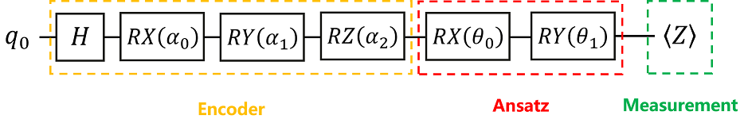

# QuTrunk与MindSpore量子神经网络初探

## 1、概述

QuTrunk 是启科量子开发和已经开源的一款量子编程框架软件产品，关于QuTrunk的详细介绍，用户可以访问启科的开发者社区站点详细了解，也可以进入github上此项目下进行查询。

QuTrunk开发框架是可以与第三方AI框架深度结合进行量子计算程序开发的，前面一篇中我们已经使用QuTrunk+paddle在VQA算法实现上做了一个小的尝试。本篇中我们将使用华为的MindSpore（昇思）与QuTrunk的结合实践来展示QuTrunk的量子计算程序开发的方法和流程。本示例类似于VQA算法的实现，我们将采用一个更简单单量子比特的量子神经网络训练程序来说明。

## 2、量子神经网络

### 2.1 简介

量子神经网络是基于量子力学原理的计算神经网络模型。1995年，Subhash Kak和Ron Chrisley独立发表了关于量子神经计算的第一个想法，他们致力于量子思维理论，认为量子效应在认知功能中起作用。然而，量子神经网络的典型研究涉及将经典的人工神经网络模型（在机器学习中广泛用于模式识别的重要任务）与量子信息的优势相结合，以发展更高效的算法。这些研究的一个重要动机是经典神经网络难以训练，特别是在大数据应用中更是如此。希望可以利用量子计算的特性，如量子并行性或干涉和纠缠效应作为资源。由于量子计算机的技术实现还处于早期阶段，此类量子神经网络模型大多是理论建议，有待在物理实验中充分实现。
大多数量子神经网络是作为前馈网络开发的。与它们的经典结构类似，这种结构从一层量子位中获取输入，并将输入传递到另一层量子位。这一层量子位评估这些信息，并将输出传递给下一层。最终，这条路径通向量子比特的最后一层层不必具有相同的宽度，这意味着它们不必具有与层之前或之后相同数量的量子比特。量子神经网络研究仍处于起步阶段，已经提出了一系列不同范围和数学严谨性的建议和想法。其中大多数都是基于用量子位（可以称为“量子位”）取代经典的二进制或McCulloch-Pitts神经元的想法，从而产生可以处于“激发”和“休息”状态叠加的神经单元。

在较广泛的领域内，研究人员试图将神经网络推广到量子环境中。构建量子神经元的一种方法是首先将经典神经元泛化，然后再将其进一步泛化，以形成幺正门。神经元之间的相互作用可以通过单一门进行量子控制，也可以通过网络状态的测量进行经典控制。通过采用不同类型的网络和量子神经元的不同实现，大多数学习算法遵循训练人工神经网络的经典模型，以学习给定训练集的输入输出函数，并使用经典反馈环路来更新量子系统的参数，直到它们收敛到最优配置。量子神经网络可以应用于算法设计：给定具有可调谐相互作用的量子位，可以尝试从期望的输入输出关系的训练集中学习遵循经典反向传播规则的相互作用，这被认为是期望的输出算法的行为。

量子神经网络在理论上可以类似于训练经典/人工神经网络。关键区别在于神经网络各层之间的通信。对于经典神经网络，在给定操作结束时，当前感知器将其输出复制到网络中的下一层感知器。然而，在量子神经网络中，每个感知器都是一个量子位，这将违反无克隆定理。对此提出的广义解决方案是用一个任意幺正来代替经典扇出方法，该幺正将一个量子位的输出扩展到下一层量子位中，但不会复制。使用这种扇出酉（$U_f$）和处于已知状态的伪态量子位，来自量子位的信息可以传输到下一层量子位。该过程符合可逆性的量子操作要求。

使用这种量子前馈网络，可以有效地执行和训练深度神经网络。深度神经网络本质上是一个具有许多隐藏层的网络，如上面的示例模型神经网络所示。由于正在讨论的量子神经网络使用扇出酉算子，并且每个算子只作用于其各自的输入，所以在任何给定时间都只使用两层。换句话说，在任何给定的时间，没有酉算子作用于整个网络，这意味着给定步骤所需的量子位数量取决于给定层中的输入数量。由于量子计算机以其在短时间内运行多次迭代的能力而臭名昭著，量子神经网络的效率仅取决于任何给定层中的量子比特数，而不取决于网络的深度。

### 2.2 量子神经网络基本结构

量子神经网络中，其量子线路结构通常由三个部分组成。

- Encoder线路即编码线路，用于将经典数据编码到量子数据
- Ansatz即训练线路，用于训练带参量子门的参数
- Measurement及测量，用于检测测量值（例如在`Z`方向上测量，就是某个量子比特的量子态在`Z`轴上的投影，该测量得到的是量子态关于泡利`Z`算符（不限定于泡利`Z`算符，换成其它的算符亦可）的期望值）是否接近于目标期望值。

量子神经网络的基本结构如下图所示，左右两边均为经典网络，中间方框内为量子网络。


## 3、QuTrunk+MindSpore量子神经网络示例

为便于理解和上手，本文参考MindQuantum教程的这个简单例子示例来展示如何使用QuTrunk+Minspore构建量子神经网络。



我们搭建如上图所示的量子神经网络，其3个部分的组成如上图所示，Encoder由$H$和$Rx，Ry，Rz$组成，Ansatz由$Rx$和$Ry$组成，Measment为`PauliZ`算符。

问题描述：我们将Encoder看成是系统对初始量子态的误差影响（参数α0,α1和α2是将原经典数据经过预处理后得到的某个固定值，即为已知值，本示例中我们之间设置为0.2, 0.3和0.4）。我们需要训练一个Ansatz来抵消掉这个误差，使得最后的量子态还是处于$\ket{0}$态。

解决思路：对末态执行泡利`PauliZ`算符测量，此时的测量值就是此时的量子态关于泡利`Z`算符的期望值。由于$\ket{0}$是算符`Z`的本征态，且本征值为1，容易知道$\bra{0}Z\ket{0}=1$.也就是说，目标期望值为1。可以通过测量得到的期望值来验证此时的状态是否为$\ket{0}$。

解决方案：通过训练Ansatz中的参数，希望测量值接近于目标期望值，换句话说，我们只需让测量值尽可能接近于$\ket{0}$态关于泡利`PauliZ`算符对应的期望值，那么此时的状态就是$\ket{0}$，即Ansatz抵消了Encoder对初始量子态产生的误差。

下面我们将展示采用QuTrunk量子编程框架结合mMindSpore如何一步步完成量子神经网络的应用。

### 3.1 导入需要的模块 

程序使用到了numpy，matplotlib，mindspore和qutrunk等，首先导入这些使用到的模块

```python
import mindspore as ms
import numpy as np
from matplotlib import pyplot as plt
from mindspore import nn, Tensor, Parameter, ops
from mindspore.nn import Adam

from qutrunk.circuit import QCircuit
from qutrunk.circuit.gates import PauliZ, Rx, Ry, H, Rz
```

并设置好随机数及使用到的目标

```python
ms.set_seed(12)  # 设置生成随机数的种子
ms.set_context(mode=ms.PYNATIVE_MODE, device_target="CPU")
```

### 3.2 搭建Encoder

构建编码线路 Encoder，将经典数据编码到量子数据，这里我们定义了一个encoder的函数如下：

```python
def circuit_encoder(encoder_data):
    alpha0, alpha1, alpha2 = [float(f) for f in encoder_data]#定义角度参数
    circuit = QCircuit()   #初始化量子线路
    qreg = circuit.allocate(1) #分配量子比特，申请一个量子寄存器
    H * qreg[0]                #对0位量子比特执行H操作
    Rx(alpha0) * qreg[0]  #Rx(alpha_0)门作用在第0位量子比特
    Ry(alpha1) * qreg[0]  #Ry(alpha_1)门作用在第0位量子比特
    Rz(alpha2) * qreg[0]  #Rz(alpha_2)门作用在第0位量子比特
    return circuit  #返回线路
```

构建的线路如下：


该量子线路由4个量子门组成，其中有3个含参量子门且参数为α0,α1,α2（3个参数值通过encoder_data这个形参传入），该量子线路调控的量子比特数为1。

### 3.3  定义Ansatz

Ansatz训练线路的函数定义如下：

```python
def circuit_ansatz():
    circuit = QCircuit()
    q = circuit.allocate(1)
    angles = ["theta-0", "theta-1"]
    params = circuit.create_parameters(angles)

    Rx(params[0]) * q[0]
    Ry(params[1]) * q[0]

    return circuit
```

其线路图为：


函数定义了一个量子比特线路，对这个比特实施参数化的$Rx$和$Ry$操作，其角度分别是$\theta1$和$\theta2$.这两个角度值通过训练优化得到。

### 3.4  定义用于测量/投影的哈密顿量

这里哈密顿量构建主要用于线路末态的测量，函数定义如下：

```python
def hamiltonian():
    circuit = QCircuit()
    qreg = circuit.allocate(1)
    return PauliZ(qreg[0])
```

对0位的量子比特执行PauliZ算符并返回。

### 3.5 连接线路并绑定参数值

前面定义了Encoder和Ansatz的线路，整个量子神经网络线路即为Encoder+Ansatz，如下即为定义整个线路构建的函数，并绑定了当前的参数值：

```python
def join_circuit(encoder, ansatz, inputs):
    params = {"theta-" + str(i): inputs[i] for i in range(len(inputs))}
    ansatz.bind_parameters(params)
    encoder.append_circuit(ansatz)
    return encoder
```

### 3.6 定义梯度计算函数

本示例同样使用参数化移位法则（parameter-shift rule）来计算梯度，参数偏移量指定为π/2，程序实现如下：

```python
def parameter_shift(inputs, exp_op, params, shift=np.pi / 2):
    """
    Backward pass computation, calculate the gradient of quantum circuit by parameter shift rule.
    """
    params = np.array(params)

    gradients = []
    for i in range(len(params)):
        shift_right = np.copy(params)
        shift_right[i] += shift
        shift_left = np.copy(params)
        shift_left[i] -= shift

        circuit = join_circuit(circuit_encoder(inputs), circuit_ansatz(), shift_right)
        expectation_right = -1 * circuit.expval_pauli(exp_op)

        circuit = join_circuit(circuit_encoder(inputs), circuit_ansatz(), shift_left)
        expectation_left = -1 * circuit.expval_pauli(exp_op)

        gradient = np.array([expectation_right]) - np.array([expectation_left])
        gradients.append(gradient)
    gradients = np.squeeze(np.array(gradients).T)
    return gradients
```

### 3.7 自定义训练网络的类

针对训练网络定义了一个类`CustomTrainOneStepCell`，这个类包含2个函数，其中`_init_`用于定义优化器及其参数，`construct`用于计算损失函数，具体实现如下：

```python
class CustomTrainOneStepCell(nn.Cell):

    def __init__(self, optimizer, exp_op):
        super(CustomTrainOneStepCell, self).__init__(auto_prefix=False)
        self.optimizer = optimizer  # 定义优化器
        self.exp_op = exp_op

        self.weights = self.optimizer.parameters  # 待更新参数
        self.grad = parameter_shift

    def construct(self, *inputs):
        inputs = inputs[0]
        # 前向计算输出
        circuit = join_circuit(circuit_encoder(inputs), circuit_ansatz(), self.weights[0])
        loss = -1 * circuit.expval_pauli(self.exp_op)

        # 用参数位移计算梯度
        grads = self.grad(inputs, self.exp_op, self.weights[0])  # 进行反向传播，计算梯度
        loss = ops.depend(loss, self.optimizer((Tensor(grads),)))  # 使用优化器更新梯度
        return loss
```

### 3.8 执行训练

- 首先设置训练网络参数的初始化值，迭代次数ITR设置为200，学习速率LR设置为0.02。
- 然后设置构建Encoder量子线路的参数在值：$\alpha0,\alpha1,\alpha2$, 其初始化值分别设置为0.2,0.3和0.4
- 最后定义测量的算符`op`为`hamiltonian`函数, 并指定优化器使用MindSpore的Aadm优化器

```python
#设置训练参数
ITR = 200
LR = 0.02
#设置Encoder线路角度初始化值
enc_d = np.array([0.2, 0.3, 0.4])
#设置测量操作符及优化器
op = hamiltonian()
opt = Adam([Parameter(Tensor(np.random.rand(2)), name="ansatz-theta")], learning_rate=LR)
```

然后通过自定义训练函数进行参数化训练，并将损失函数报错到列表中

```python
train_net = CustomTrainOneStepCell(opt, op)

loss_list = []
for i in range(ITR):
    res = train_net(Tensor(enc_d))
    loss_list.append(res)
    if i % 10 == 0:
        print(i, ": ",'%.4f' % res)
```

通过迭代训练，打印输出的结果如下，可以看到通过230迭代后，loss不断变小收敛，并达到目标值-1。

```python
0 :  0.7668
10 :  0.5777
20 :  0.3326
30 :  0.0474
40 :  -0.2464
50 :  -0.5100
60 :  -0.7138
70 :  -0.8490
80 :  -0.9264
90 :  -0.9651
100 :  -0.9826
110 :  -0.9901
120 :  -0.9936
130 :  -0.9956
140 :  -0.9969
150 :  -0.9979
160 :  -0.9986
170 :  -0.9991
180 :  -0.9994
190 :  -0.9996
200 :  -0.9998
210 :  -0.9999
220 :  -0.9999
230 :  -1.0000
```

### 3.9 结果呈现

由于测量值接近收敛于-1，所以我们可以打印此时Ansatz中的参数。

```python
ans_d = train_net.weights[0]
print("final theta: ", ans_d.value())
```

得到的$\theta1$的值为2.19643544。$\theta2$的值为-1.07710791

```python
final theta:  [ 2.19642544 -1.07710791]
```

同时也可以获取到此时最优参数下的量子线路的状态向量和fidelity值及打印最终线路图，程序实现如下：

```python
circ = join_circuit(circuit_encoder(enc_d), circuit_ansatz(), ans_d)
state = circ.get_statevector()
print("state: ", str(state))
fid = np.abs(np.vdot(state, [1, 0])) ** 2
print("fidelity", ": ", fid)
circ.draw()
```

得到的结果如下：

```python
state:  [0.38983534-0.92082061j 0.0097964 +0.00467482j]
fidelity :  0.999882176674514
```

打印的线路图为：


为了更形象的展示损失函数的下降趋势，我们也可以通过matplot打印出其损失函数的曲线，程序如下：

```python
plt.figure(1)
ITR_list = []
for i in range(ITR):
    ITR_list.append(i)
func = plt.plot(ITR_list, loss_list, alpha=0.7, marker='', linestyle='-', color='r')
plt.xlabel('iterations')
plt.ylabel('loss')
plt.legend(labels=["loss function during iteration"], loc='best')
plt.show()
```

打印的曲线图如下：


## 4、总结

以上的示例只是QuTrunk与MindSpore结合的一次小的尝试，通过这次QuTrunk的量子编程框架和MindSpore AI深度学习框架的结合实践的探索，也为后续的深层次合作提供了较好的参考，QuTrunk将继续深入探索与MinSpore的结合最佳实践。
