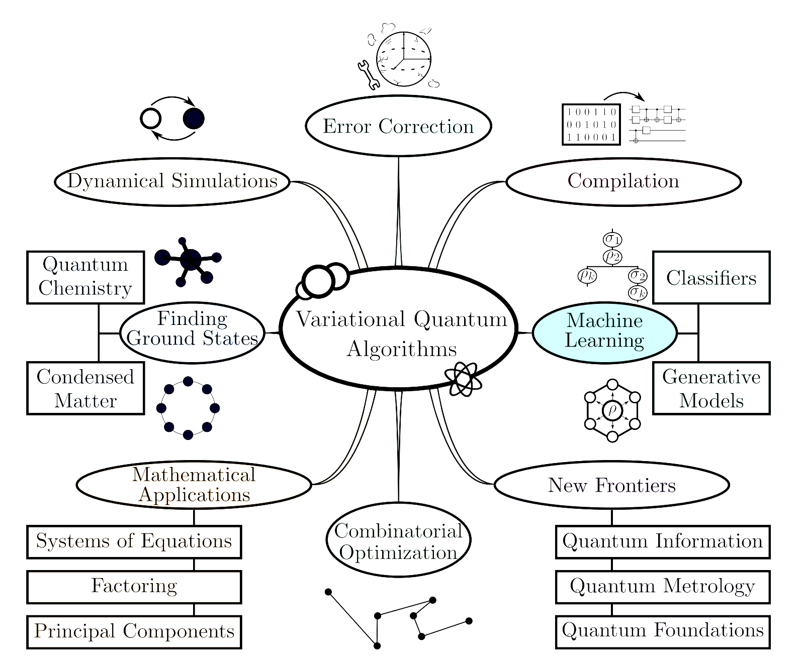
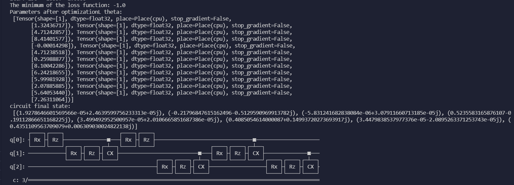
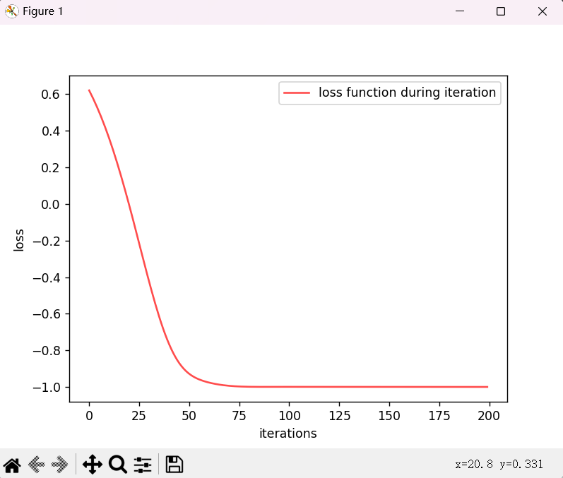

# QuTrunk与Paddle结合实践--VQA算法示例

## 1、概述

QuTrunk 是启科量子开发和已经开源的一款量子编程框架软件产品，它使用 Python 作为宿主语言，利用Python 的语法特性实现针对量子程序的 DSL(领域专用语言)，所有支持 Python 编程的 IDE 均可安装使用 QuTrunk。QuTrunk 基于量子逻辑门、量子线路等概念提供量子编程所需的各类API。这些 API 分别由相应的模块实现，比如 QCircuit 实现量子线路功能，Qubit 实现量子比特，Qureg 实现量子寄存器，Command 对应每个量子门操作的指令， Backend 代表运行量子线路的后端模块，gate 模块实现了各类基础量子门操作。同时 QuTrunk 还可以作为其他上层量子计算应用的基础，比如：量子算法、量子可视化编程、量子机器学习等。QuTrunk 设有多种量子计算后端模块，如：BackendLocalPy(本地 Python 版本模拟器)；BackendLocalCpp(本地 C++版本模拟器)；BackendQuSprout(量子计算云服务)；BackendIBM(IBM 量子云计算平台)等。QuTrunk 对所有量子逻辑门及量子编程涉及到的基本概念进行了封装与实现，支持主流的量子算法。在使用 QuTrunk 进行量子编程时， 开发者只需通过提供的量子编程 API 即可直接调用量子逻辑门进行使用。QuTrunk 也支持混合量子-经典程序编写，已设计了量子线路分段执行机制， 提供 QuSL 量子汇编指令标准，与 Python 代码完全兼容。完整了解QuTrunk的文档请参考开发者社区上的相关文章介绍：[启科开发者平台 (queco.cn)](http://developer.queco.cn/)

QuTrunk的github链接：[QuTrunk](https://github.com/qudoor/qutrunk)

PaddlePaddle是百度发布的一款AI框架（下面简称Paddle），QuTrunk框架的特性天然支持与Paddle的结合，通过使用QuTrunk开发量子计算+AI融合的应用程序以帮助用户解决各领域在经典计算机无法解决或者解决起来耗时很长复杂问题。本文主要通过量子计算上常用的VQA算法示例来展示如何使用QuTrunk和Paddle结合。

## 2、VQA算法简介

### 2.1 VQA算法定义

变分量子算法（variational quantum algorithm, VQA）其实就是用一个经典优化器（classical optimizer）来训练一个含参量子线路（quantum circuit），即VQA使用参数化的量子电路在量子计算机上进行计算，然后把参数的优化训练丢给经典优化器来处理，从而充分利用了经典优化的工具箱。与其他为容错时代开发的量子算法相比，VQA具有保持量子电路深度较浅从而降低噪声的额外优势，因而VQA也成为NISQ上设备取得量子优势的主要策略，在大量的应用中被使用，基本上涵盖了研究人员为量子计算机设想的所有应用，如下图所示：




### 2.2 VQA基本元素介绍

VQA的主要优点之一是它提供了一个通用框架，可用于解决各种问题。尽管这种多功能性转化为具有不同复杂度级别的不同算法结构，但大多数（如果不是所有）VQA都有一些共同的基本元素。它有些像是机器学习在量子计算中的自然类比，经典机器学习框架中有四个要素：

1. 数据$\{(x_k,y_k)\}$
2. 模型$\  y=f(x;θ)$
3. 损失函数 $C(θ)=\tilde{C} (f(x_k;θ),y_k)$
4. 优化器$\theta= \underset{\theta }{argmin}C(\theta )$ 

我们的目标是找到一个可以拟合数据 ${(x_k,y_k)} $的模型 $y=f(x;θ)$，即确定一组最优的参数 θ 。确定 θ的方法就是让模型与给定的数据尽可能地接近（但不过拟合），接近程度由损失函数 $C(θ)$ 来定义。利用一些优化器来找到  $C(θ)$ 的最小值点，目标即可达成。

- 对于经典机器学习算法，model通常是一个在经典计算机上运行的神经网络；
- 对于变分量子算法，model是一个在量子计算机上运行的量子电路t；


对比经典ML，VQA算法的4个基本元素为：损失函数，ansatz，梯度和优化器。下面分别介绍：

#### 2.2.1 损失函数

VQA的一个重要方面是将问题编码为损失函数。类似于经典的机器学习，损失函数将可训练参数θ的值映射到实数，优化任务是找到损失函数的全局最小值，损失函数的数学表达式如下：
$$
C(\theta)=\sum_{k}f_k\left ( Tr\left [ O_kU(\theta )\rho_kU^{†}(\theta)\right]\right )
$$
如上（1）式中，U(θ)是参数化的酉，θ由离散和连续的参数组成，${\{\rho_k\} }$是训练集的输入状态，${\{O_k\} }$是一组可观察值，$f_k$是编码任务的函数。对于一个给定的问题，可以有不同的$f_k$选择。损失函数的构建需满足如下准则：

1. 损失必须是可信的，因C(θ)的最小值对应于问题的解；
2. 在量子计算机上进行测量并可能进行经典后处理，从而来有效地估算C(θ)。这里隐含的假设是损失不能用经典计算机有效地计算，否则VQA不能实现量子优势；
3. C(θ)在操作上是有意义的，较小的损失值代表更好的解；
4. 损失必须是可训练的，以便有效优化参数。

为了在NISQ硬件中实现给定的VQA，用于$C(\theta)$估计的量子电路必须保持电路深度和辅助要求较小。这是因为NISQ器件容易发生门错误，量子比特计数有限，并且这些量子比特的退相干时间短,因而构建有效的损失函数量子电路是VQA的一个重要方面。

#### 2.2.2 ansatz

VQA另外一个重要的方面是ansatz，它是依赖于一组可以优化的连续或离散参数θ的量子操作。ansatz的形式决定参数θ，需要训练它们以最小化损失。一方面ansatz的具体结构通常取决于具体问题，因为在许多情况下，人们可以利用有关问题的信息来解决问题。另一方面，一些ansatz体系结构是通用的，与问题无关，这意味着即使没有相关信息可用，也可以使用它们。对于公式（1）的损失函数，可以将参数θ编码为应用于量子电路的输入状态的酉U(θ)。U(θ)可以一般表示为L个顺序应用的单位的乘积
$$
U(\theta)=U_L(\theta_L)\cdots U_2(\theta_2)U_1(\theta_1) \  其中U_l(\theta_l)=\prod_{m}e^{-i\theta_mH_m}W_m
$$
其中$W_m$是非参数化酉算子，$H_m$是厄米算子；$θ_l$是θ中的第l个元素。

#### 2.2.3 梯度

一旦定义了损失函数和ansatz，下一步是训练参数θ并解损失函数的优化问题。众所周知，对于许多优化任务，使用损失函数梯度（或高阶导数）中的信息可以帮助加快并保证优化器的收敛。梯度的计算可以使用参数化移位法则（parameter-shift rule）。假设参数θ全都以 **Pauli 矩阵旋转角**的形式出现，即$U(\theta)\longleftarrow U(e^{i\sigma\theta})$,通过对损失函数进行计算，可证明有如下性质：
$$
\frac{\partial C}{\partial \theta_l }=\sum_{k}\frac{1}{2sin\alpha }  \left ( Tr\left [O_k U^{†}(\theta_+)\rho_kU(\theta_+)\right ]-Tr\left [ O_kU^{†}(\theta_- )\rho_kU(\theta_- )\right ] \right )
其中\theta_\pm=\theta\pm \alpha e_l
$$
其中$e_l$是一个向量，是第l个元素其值1，否则为0。等式（3）表明，可以通过将第l个参数偏移一定量α来评估梯度。请注意，评估的准确性取决于系数1/（2sinα），因为每个±α项都是通过采样$O_k$来评估的。由于1/sinα在这一点上是最小的，所以在α=π/4时，评估的精度最大。尽管参数移位规则可能类似于原始有限差分，但它通过系数1/sinα来评估参数的解析梯度。最后，更一般的$f_k(x)$的梯度可以通过使用链式法则从等式（3）获得。

#### 2.2.4 优化器（Optimizers）

对于任何变分量子算法，VQA的成功取决于所采用的优化方法的效率和可靠性。VQA与经典优化器相关的优化问题通常预计是N-P难的，因为涉及的损失函数可以有许多局部最小值。除了复杂经典优化中遇到的典型困难外，当对VQA进行训练时还会遇到一些新的挑战，包括诸如由于测量预算有限而导致的固有随机环境、硬件噪声等。这也导致了许多量子感知优化器的发展。在这里，我们将讨论一些为变分量子算法设计或推广的优化器。为了方便起见，根据它们是否实现了梯度下降，将它们分为两类。

一种是梯度下降法，它是目前最常见的优化方法之一，按照梯度指示的方向进行迭代。鉴于只有统计估计可用于这些梯度，这些策略属于随机梯度下降(SGD)的范畴。一种从机器学习领域引入的SGD方法是Adam，它调整优化过程中采取的步骤的大小，以允许比通过基本SGD获得的解决方案更有效和更精确的解决方案。受机器学习文献启发的另一种方法在每次迭代中调整精度(即每次估计的执行次数)，而不是步长，以节省所使用的量子资源。

另一种不同的基于梯度的方法是基于假设一个假想的时间演化，或者等效地通过使用基于信息几何概念的量子自然梯度衰减法。虽然标准梯度下降在参数空间的l2(欧几里德)几何中的最陡的下降方向上采取步骤，但是自然梯度下降在具有度量张量的空间上工作，该度量张量编码了量子状态对参数变化的灵敏度。使用这种度量，通常会加速梯度更新步骤的收敛，允许用更少的迭代达到给定的精度水平。这种方法也被扩展到包含噪声的影响。

Paddle框架中提供了Adm和SGD等优化器。根据使用场景和意愿来选择。

### 2.3 VQA实现过程

为了使混合经典-量子计算成功，需要克服两个挑战。首先，我们需要找到参数化量子电路，这些量子电路具有表达能力，能够对相关优化问题的最优解产生足够好的近似。第二，量子电路参数的经典优化需要足够快和准确地解决。下图中展示了变分量子算法优化过程：


其主要实现的过程和步骤为：

1. 首先定义损失函数$C(θ)$ ，对问题的解进行编码；
2. 其次输出ansatz，即依赖于一组可以优化的连续或离散参数θ的量子操作；
3. 最后使用来自训练集的数据在混合量子经典循环中训练该ansatz以解决优化任务

## 3、QuTrunk+Paddle VQA算法应用实现

为便于理解，本文通过我们以制备量子态为例，介绍基于QuTrunk加Paddle框架使用变分量子算法（Variational Quantum Algorithms, VQA），即使用量子神经网络解决优化问题的基本思想与算法框架。

量子神经网络使用量子态与量子门构建电路。一个量子神经网络，也同样可以通过其结构(电路内量子门的连结方式)，以及一组可调参数 $\vec{\theta}$ (对应量子门的旋转角度）来表示。


上图是一个含有三个量子比特，六个参数可调量子门，仅一层的量子神经网络。其中 $R_x(θ_1)$ 指一个绕 x-轴旋转 $θ_1$ 角度的量子门, ${θ_1,⋯,θ_6}$ 为可调参数.

- 注1: 任意量子门可以被以任意精度分解为单量子比特门与双量子比特门 (例：CNOT 门)。
- 注2: 单量子比特门总可以通过其旋转轴与旋转角度 θ 表示。

由以上可得，通过深度足够的量子电路并调整每一个单量子比特门旋转角度 θ，量子电路可模拟任意多量子比特门。

数学上，变分量子算法（使用量子神经网络解优化问题）可以表述为： 通过调节（结构给定）量子神经网络中可调参数 θ，得到最优的输出量子态 $ρ(\vec{\theta})$, 以及最小化损失函数 $L(ρ(\vec{\theta}))$。通常输入量子态选取 $\left | 00\cdots 0 \right \rangle $。

下面将按逻辑顺序来讲解qutrunk和paddle结合下，通过VQA算法来优化量子线路获取最优参数的具体实现过程。

### 3.1 导入需要的包 

程序使用到了numpy，pyplot，paddle和qutrunk等，首先通过如下带来引入必要的 library 和 package

```python
import numpy as np
import matplotlib.pyplot as plt
import random
import paddle
from paddle.autograd import PyLayer
from typing import Union, Optional

from qutrunk.circuit import QCircuit
from qutrunk.circuit.gates import Rx, Rz, CNOT, PauliZ
```

### 3.2 定义参数化量子线路函数

首先定义用于训练的含参数的量子电路即量子神经网络，量子比特数和深度作为传入参数，可以在主函数中指定，针对每个量子比特执行Rx，Rz旋转门操作，角度值采用随机数生成，并对其执行CNOT操作：

```python
# 定义用于训练的含参量子线路
def circuit_ansatz(num_qubits, depth):
    circuit = QCircuit()
    q = circuit.allocate(num_qubits)
    angles = ["theta-" + str(i) for i in range(2 * num_qubits * depth)]
    params = circuit.create_parameters(angles)

    idx = 0
    for i in range(depth):
        for j in range(num_qubits):
            Rx(params[idx]) * q[j]
            idx += 1
        for j in range(num_qubits):
            Rz(params[idx]) * q[j]
            idx += 1
        for j in range(num_qubits - 1):
            CNOT * (q[j], q[j+1])
    
    return circuit, PauliZ(q[0])
```

### 3.3  定义计算量子线路梯度值函数

梯度的计算使用参数化移位法则（parameter-shift rule），按照公式（3）的规则来计算，参数偏移量指定为π/2

```python
# 计算量子线路梯度值
def parameter_shift(circuit, exp_op, input_data, shift=np.pi/2):
    """ 
    Backward pass computation, calculate the gradient of quantum circuit by parameter shift rule.
    """
    input_list = np.array(input_data)
    
    gradients = []
    for i in range(len(input_list)):
        shift_right = np.copy(input_list)
        shift_right[i] += shift
        shift_left = np.copy(input_list)
        shift_left[i] -= shift

        params = {"theta-" + str(i): shift_right[i] for i in range(len(shift_right))}
        cir = circuit.bind_parameters(params)
        expectation_right = cir.expval_pauli(exp_op)

        params = {"theta-" + str(i): shift_left[i] for i in range(len(shift_left))}
        cir = circuit.bind_parameters(params)
        expectation_left = cir.expval_pauli(exp_op)
        
        gradient = np.array([expectation_right]) - np.array([expectation_left])
        gradients.append(gradient)
    gradients = np.squeeze(np.array(gradients).T)
    return gradients
```

### 3.4  通过Pylayer定义电路层类

通过Paddle的Pylayer将QuTrunk构建的量子电路转换成到其深度学习的神经网络，其中forward函数用于运行量子线路返回计算结果，backward函数用于调用梯度计算函数计算线路梯度，用于学习优化参数。

```python
# define circuit layer by PyLayer
class CircuitLayer(PyLayer):
    @staticmethod
    def forward(ctx, circuit, exp_op, x):
        params = {"theta-" + str(i): x[i] for i in range(len(x))}
        cir = circuit.bind_parameters(params)
        expval = cir.expval_pauli(exp_op)
        out = paddle.to_tensor(expval, stop_gradient=False)
        ctx.save_for_backward(circuit, exp_op, x)
        return out

    @staticmethod
    def backward(ctx, dy):
        circuit, exp_op, input_data, = ctx.saved_tensor()
        grad = parameter_shift(circuit, exp_op, input_data)
        gradients = []
        for g in grad:
            gradients.append(paddle.to_tensor(g, dtype='float32', stop_gradient=False))
        return tuple(gradients)
```

### 3.3 定义初始化参数

程序开始先定义出量子线路及量子神经网络训练所需要的的参数，例如：迭代次数ITR，学习速率LR，构建量子线路的量子数：num_qubits，线路深度：deph，以及记录迭代中间过程的list参数，loss_list(损失值列表）,parameter_list（旋转角度参数列表）

```python
# 首先，我们给出一些训练用参数
ITR = 125      # 学习迭代次数
LR = 0.02       # 学习速率

# 记录迭代中间过程:
loss_list = []
parameter_list = []
# 构造线路
num_qubits = 3
depth = 2
```

### 3.4 构建量子线路

首先构造随机参数

```python
# 随机构造参数，
angles = [random.random() * 10 for _ in range(2 * num_qubits * depth)]
# paddle tensor
params = [paddle.to_tensor(angles[i], stop_gradient=False) for i in range(len(angles))]
```

然后根据定义的函数，构建量子电路，并绑定随机参数到线路上

```python
circuit, op = circuit_ansatz(num_qubits, depth)
```

### 3.5 通过 Paddle优化器优化量子线路

程序调用了Paddle的Adam优化器来优化线路，如下：

```python
# optimizer 
opt = paddle.optimizer.Adam(learning_rate = LR, parameters = params)
```

然后通过定义训练的总次数进行迭代，并打印训练结果。

```python
# 迭代优化
for itr in range(ITR):
    out = CircuitLayer.apply(circuit, op, params)
    # 计算损失函数
    loss = out.mean()
    # 通过梯度下降算法优化
    loss.backward()
    opt.minimize(loss)
    opt.clear_grad()
    # 记录学习曲线
    loss_list.append(loss.numpy()[0])
    if itr % 10 == 0:
        print('iter:', itr, '  loss: %.4f' % loss.numpy())
```

通过迭代训练，打印输出的结果如下，可以看到通过115迭代后，loss不断变小收敛，逐步接近目标值-1。

```python
PS D:\dev_huangwen\dev-xjw\qutrunk\qutrunk\example\jupyter> & C:/Users/huang/AppData/Local/Programs/Python/Python310/python.exe d:/dev_huangwen/dev-xjw/qutrunk/qutrunk/example/jupyter/test.py
iter: 0   loss: 0.6207
iter: 10   loss: 0.3586
iter: 20   loss: -0.0058
iter: 30   loss: -0.4258
iter: 40   loss: -0.7671
iter: 50   loss: -0.9282
iter: 60   loss: -0.9765
iter: 70   loss: -0.9940
iter: 80   loss: -0.9992
iter: 90   loss: -0.9997
iter: 100   loss: -0.9995
iter: 110   loss: -0.9998
iter: 120   loss: -1.0000
iter: 130   loss: -1.0000
iter: 140   loss: -1.0000
iter: 150   loss: -1.0000
iter: 160   loss: -1.0000
iter: 170   loss: -1.0000
iter: 180   loss: -1.0000
iter: 190   loss: -1.0000
```

### 3.6 输出结果

通过迭代后，我们将损失函数最终值、量子线路参数和最终量子态通过print输出，最后打印出电路图

```python
# 输出最终损失函数值
print('The minimum of the loss function:', loss_list[-1])
# 输出最终量子电路参数
print("Parameters after optimizationL theta:\n", params)
# 输出最终量子态
params = {"theta-" + str(i): params[i] for i in range(len(params))}
cir = circuit.bind_parameters(params)
state = cir.get_statevector()
print("circuit final state:\n", state)
# 绘制电路
circuit.draw()
```

结果如下：



为了更形象的展示迭代优化效果，我们也可以通过绘制其曲线来详细展示，程序如下

```python
# 绘制迭代过程中损失函数变化曲线
plt.figure(1)
ITR_list = []
for i in range(ITR):
    ITR_list.append(i)
func = plt.plot(ITR_list, loss_list, alpha=0.7, marker='', linestyle='-', color='r')
plt.xlabel('iterations')
plt.ylabel('loss')
plt.legend(labels=["loss function during iteration"], loc='best')
plt.show()
```

最后运行输出的效果如下图所示：



## 4、总结

以上的示例只是QuTrunk与Paddle结合的一次小的尝试，通过这次QuTrunk的量子编程框架和Paddle AI深度学习框架的结合实践的探索，也为后续的深层次合作提供了较好的参考，QuTrunk将继续深入探索与Paddle的结合最佳实践。
