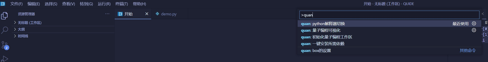

#                               **QuTrunk 快速上手指导**（qutrunk-0.1.11版本）

## **1 QuBranch & QuTrunk介绍**

###    1.1 QuBranch  

QuBranch是由启科量子基于vscode开发的量子编程集成开发环境，产品的详细介绍请参看QuSaaS链接：[QuIBranch](http://developer.queco.cn/product/detail?id=32)   

###    1.2 QuTrunk   

- QuTrunk 是启科量子自主研发的一款免费、开源、跨平台的量子计算编程框架，包括量子编程API、量子命令转译、量子计算后端接口等。

- QuTrunk 使用 Python 作为宿主语言，利用 Python 的语法特性实现针对量子程序的 DSL (领域专用语言)，所有使用 Python 编程的 IDE 均可使用安装。
- QuTrunk 基于量子逻辑门、量子线路等概念提供量子编程所需各类 API，这些 API 由相应的模块实现。例如 QCircuit 实现量子线路，Qubit 实现量子比特，Qureg 实现量子寄存器，Command 实现每个量子门操作的指令，Backend 实现运行量子线路的后端模块，gate 模块实现各类基础量子门操作。
- QuTrunk 还可以作为其他上层量子计算应用的基础，例如：量子算法、量子可视化编程、量子机器学习等  

 QuTrunk内部模块划分及层次结构如下：


#### **1.2.1 QuTrunk核心模块**

------

- cicuit: 量子线路，通过应用各类基础门操作以及算符操作构建量子线路，代表了整个量子算法的实现。
- qubit: 代表单个量子比特，是量子门和量子算符操作的目标对象。
- qureg: 用于申请量子计算资源，维护若干个量子比特，用于实现某个具体的量子算法。
- gate: 量子逻辑门模块，提供各类基础量子门操作，包括:*H*, *X*, *Y*, *Z*，*P*, *R*, *Rx*, *Ry*, *Rz*, *S*, *Sdg*, *T*, *Tdg*, *CNOT*, *Toffoli*, *Swap*等。
- operator: 量子算符操作，通过若干基础量子门实现某些通用量子操作，比如振幅放大QAA, 量子傅立叶变换QFT等。
- command: 对量子线路中所有门级操作做参数化处理，对接目标后端模块，用于运行整个量子线路。
- qasm: 兼容OpenQASM 2.0标准，实现量子线路到OpenQASM指令的序列化和反序列化。
- qusl: QuTrunk量子汇编标准，实现与qasm类似功能。
- backend: 量子计算后端模块，用于执行量子线路，支持Python本地后端，qusprout和qusaas两种远程后端以及第三方后端(目前支持IBM)。
- qusprout: 对接启科研制的qubox设备，使用经典计算资源并针对量子计算特点做优化，提供高性能量子模拟计算服务。
- qusaas: 对接启科量子计算云平台，接入多种量子计算资源，包括经典计算资源，离子阱量子计算机（研发中）。

#### 1.2.2 QuTrunk主要特点

------

- 基于量子逻辑门、量子算符和量子线路实现量子程序开发。
- 提供QuSL量子汇编指令标准，QuSL量子汇编与Python代码完全兼容。
- 设备独立，同一个量子线路只需替换后端类型即可以在不同的量子后端上运行。
- 提供多种量子计算体验，本地量子计算提供Python计算后端，远程后端提供OMP多线程、MPI多节点并行、GPU加速等计算模式，同时预留了接口对接启科量子自行研制的离子阱量子计算机。
- 兼容多种量子汇编指令格式：OpenQASM 2.0标准和QuSL汇编标准。
- 支持量子可视化编程（需要配合启科量子研发的量子集成开发环境 QuBranch）。

## 2  QuBranch安装  

QuBranch安装前提是本地已安装好Python3环境安装，本指导中的示例使用的是python3.10，Python官网下载地址：[python3官网下载](https://www.python.org/downloads/) 

python3.10的安装方法这里不赘述，可以通过官网文档查询指导自行安装。

QuBranch支持Windows，MacOS和Linux操作系统，各系统上的安装方法下面章节会分别介绍。

*注意：QuBranch相关的安装包发布到了QuSaaS（启科量子开发者社区）上，用户需先注册账号登录后下载，注册qusaas账号有机会和开发者大牛交流和及时获取帮助，注册链接如下：*

[QuSaaS注册](http://developer.queco.cn/login/index?redirect_url=/&sign_type=login)

###   **2.1 Windows系统**  

  下载地址：[QuBranch下载](http://developer.queco.cn/download/list) 

  下载完成后，双击QuBranchSetup.exe，根据界面提示执行各步骤就可以完成安装。建议用户安装到非系统盘  

###   **2.2 MacOS & Linux系统**  

  这两个系统下当前无QuBranch的独立安装包，需从微软官网先下载vscode，然后再安装qun-graph插件。  

1. ​    下载和安装: [vscode](https://code.visualstudio.com)，从官网直接下载一般较慢，可通过设置国内镜像加速，方法如下：点击下载后复制下载链接，将链接中的az764295.vo.msecnd.net 更换为 vscode.cdn.azure.cn，然后重新执行下载即可。  

2. 下载插件：[quan-graph]([下载 (queco.cn)](http://developer.queco.cn/download/list))

3. 打开vscode，右侧导航栏选择扩展，然后点击三点打开菜单，选择从VSIX文件安装，从下载目录选择qun-graph的安装包，点击安装  

       

​      安装会自动安装相关依赖包，完成后效果如图：  
​         

## **3 QuTrunk下载及安装**   

QuTrunk支持pip在线安装，whl安装包直接安装以及源码编译安装。whl包和源码已经发布到pypi源和qusaas下载中心 。用户可以通过项目站点直接下载安装。

- pypi站点下载链接： [QuTrunk](https://pypi.org/project/qutrunk/#files)  

- 通过QuSaaS下载中心下载： [QuTrunk](http://developer.queco.cn/download/list)


各安装方法指导如下：(以qutrunk-0.1.11版本示例，用户使用以发布最新的版本为准)

### 3.1 pip安装

命令行执行如下指令安装：

```python
pip3 install qutrunk
```

### 3.2 whl包本地安装

从上面提供的站点链接下载下来whl安装包，然后打开终端，切换到下载目录，执行本地安装：

```python
pip3 install qutrunk-0.1.11-py3-none-any.whl
```

### 3.3 源码安装方法

将从上述下载地址下载到的源码安装包进行解压，命令行上执行如下命令：  

```python
tar -zxvf qutrunk-0.1.11.tar.gz
cd qutrunk-0.1.11
python3 setup.py install 
```

### **3.4 Qutrunk安装完成后检查**

Qutrunk安装完成后可以执行如下命令验证安装是否成功，版本是否准确，命令各平台通用：

```python
pip3 show qutrunk
```

然后python命令行执行：

```python
import qutrunk
qutrunk.run_check()
```

输出结果为："QuTrunk is installed successfully! You can use QuTrunk now."表明QuTrunk安装成功。

## 4 QuTrunk量子编程

### 4.1 Demo程序编写

QuTrunk部署完成后，可以开始我们的第一个hello world程序运行了。

#### 4.1.1 Python解释器切换  

windows及Linux下执行ctrl+shift+p，macOS下执行command+shift+p，打开命令行，输入quan搜索，选择**quan：python解释器切换**。python解释器切换可切换全工作区或为单一项目切换python环境。  
  


打开选择界面后，可以通过加号自己输入，也可以选择recommend，还有安装了python版本的路径。本示例中选择recommend本地安装了python3.10.5的64bit版本  
  
选择完成后，windows上可以查询左下角解释器版本是否一致。

#### 4.1.2 新建工作区  

在需要保存的目录下新建一个目录，示例中Qun-Demo，在IDE开始界面，选择打开文件夹，然后选中新建的文件夹打开,显示如下：  
  

#### 4.1.3 量子计算Demo程序编写及运行

从开始界面，选择新建python文件，并保存为demo.py,下面的代码为bell_pair算法例子：  

``` python
from qutrunk.circuit import QCircuit
from qutrunk.circuit.gates import H, CNOT, Measure

qc = QCircuit()
qr = qc.allocate(2) # allocate

H * qr[0]   # apply gate
CNOT * (qr[0], qr[1])
Measure * qr[0]
Measure * qr[1]

qc.print();# print circuit
res = qc.run(shots=1024) # run circuit
print(res.get_counts()) # print result

qc.draw() #print quantum circuit
```

上面程序运行结果如下：  


程序结果说明如下：

1. "[{"00": 498}, {"11": 526}]": 为量子线路运行统计结果，因为指明了线路运行1024次，  所以输出的结果为：出现“00”的次数为498；出现“11”的次数为526
2.  下面的是输出的量子线路图，q[0] 和q[1]是两个量子比特分别作用H门，CX门然后分别实施测量    

### 4.2 可视化编程

#### 4.2.1 初始化量子编程工作区  

​          打开IDE，先初始化量子编程工作区：windows上按ctrl+shift+p，macOS上command+shift+p打开命令行，输入quan搜索，选择quan：初始化量子编程工作区，执行初始化。启动初始化可视化编程工作区功能，将为用户建立一个虚拟工作区用于可视化编程。  
  

#### 4.2.2 启动可视化量子编程  

​         再次按ctrl+shift+p/comand+shift+p，输入quan搜索，可以看到量子可视化编程已经出现，选择“quan:量子可视化编程“启动量子编程可视化功能。该功能允许用户生成多个可视化编程的qdoor文件，并且切换不同的qdoor文件生成不同的量子电路图，亦允许您使用编程的方式或者使用可视化拖拽的方式编辑电路图，将量子门图入电路图中生成电路图，将量子门从电路图中拖出可删除量子门。目前支持H、NOT、Sdg、Toffoli、Tdg、X、Y、Z、P、Rx、Ry、Rz、R、SqrtX、T、Measure，其中X、Y、Z、P、Rx、Ry、Rz允许添加一个控制位，Rx、Ry、Rz允许变更旋转角。并提供了关键字高亮，代码提示，代码自动完成等功能。借助Qutrunk的能力您可以查看当前量子电路图的量子态统计。  
    

#### 4.2.3 开始进行可视化编程示例

在可视化编程页面，用户可以通过托拉拽的方式选择各图形化编程元素加入或者删除完成编程，删除只需将元素脱出窗外松开即可，可视化编程示例如下：  
 

### 4.3 配置后端量子计算资源

​      目前QuTrunk量子计算框架支持多种后端计算资源，常用的有两种：一种是local即调用本地计算资源模拟量子计算，一种是调用QuSprout后端计算资源。以上示例没有指定的情况下均是直接使用local。下面示例讲述如何切换后端计算资源

#### 4.3.1  设置调用QuSprout的IP地址和端口

设置qusprout的访问地址和端口有两种方式设置：

**1）第一种方式是通过QuBranch的命令面板设置**

打开QuBranch命令行面板(windows: 按ctrl+shift+p; macOS: 按command+shift+p)，选择“quan: box的设置”，  设置QuBox的ip:port(地址和端口号)，本示例中使用的是测试的qusprout的服务器：192.168.170.195:9091然后按enter建完成设定。

目前内部测试qusprout的地址可以临时用（192.168.170.214:9091）来验证


**2）通过修改qubox的配置文件**

首先命令行上执行pip3 show qutrunk 可以找到qutrunk安装的地址Location，如下图所示


然后进入到此地址下的:Location路径\qutrunk\config\ 目录下，修改qubox.xml地址，如下：


#### 4.3.2 代码中指定QuSprout为计算后端

首先需要先导入后端模块backends中的BackendQuSprout，然后在构建量子线路的时候指定后端参数为QuSprout

以下此示例仍以bell_pair算法为例：

```python
from qutrunk.circuit import QCircuit
from qutrunk.circuit.gates import H, CNOT, Measure
from qutrunk.backends import BackendQuSprout#引入QuSprout计算后端模块


qc = QCircuit(backend=BackendQuSprout()) #指定QuSprout作为计算后端
qr = qc.allocate(2) # allocate

H * qr[0]   # apply gate
CNOT * (qr[0], qr[1])
Measure * qr[0]
Measure *| qr[1]

qc.print()   # print circuit
res = qc.run(shots=1024) # run circuit
print(res.get_counts()) # print result


qc.draw()
```

程序运行结果如下图，可以看到运行结果与上面使用本地资源计算结果一致


## 5  QuTrunk参考资料

如果需要对Qutrunk做全面了解，请访问QuSaaS平台：[启科开发者平台 (queco.cn)](http://developer.queco.cn/)
